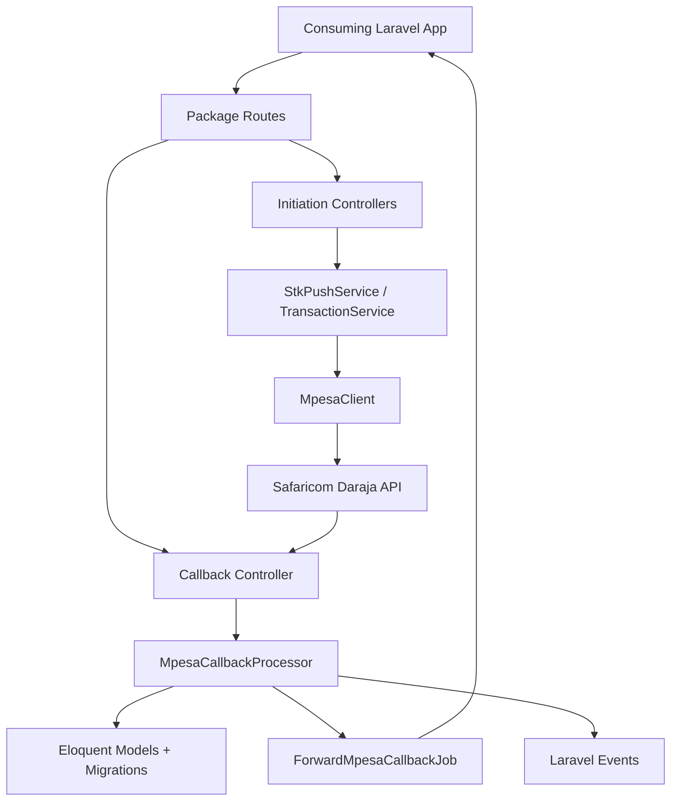

# Laravel M-Pesa Package Documentation

## Overview

This package was built to convert a repeatedly reused Laravel M-Pesa integration pattern into a reusable, plug and play Laravel package.

The original motivation was simple:

- repeated M-Pesa integrations across different Laravel projects were leading to copy-paste reuse
- the repeated code had already matured into a practical internal scaffold
- instead of continuing to duplicate that scaffold, the integration was extracted into a package structure

The result is a Laravel package that provides:

- reusable Daraja API access
- HTTP endpoints for initiating M-Pesa operations
- callback endpoints for Daraja responses
- persistence for requests, responses, and payment confirmations
- callback forwarding to client applications
- package-level security controls
- journey-specific logging separation for high-volume traffic
- extension points for customization
- automated tests
- CI configuration for ongoing verification

This document explains in detail what has been implemented.

## Architecture Diagram



## Original Source Of The Package Design

A local Laravel application scaffold was found under:

- `resources/MAUZO`

That application already contained a working M-Pesa integration including:

- `MpesaRepository`
- STK push initiation logic
- callback processing
- payment recording
- callback forwarding
- B2C flow handling
- transaction-oriented models and migrations

That existing scaffold became the reference implementation for the package design.

The package does not blindly copy the whole app. Instead, it extracts the reusable integration concerns and leaves application-specific business concerns out.

## Main Goal Achieved

We successfully transformed a project-specific M-Pesa scaffold into a package that can be installed locally into other Laravel projects and used as a reusable integration layer.

In practical terms, the package now supports:

- STK push initiation
- STK push query
- C2B register URLs
- C2B simulate
- B2C
- B2B
- reversal
- account balance
- transaction status
- callback receipt and processing
- local persistence of transaction state
- optional callback forwarding back to the consuming application

## Package Structure

The package now contains the following major layers:

- service provider and package registration
- config
- facade
- Daraja API client
- HTTP controllers
- route definitions
- persistence models
- migrations
- callback processing services
- initiation services
- jobs
- middleware
- contracts and customization hooks
- events
- tests
- CI workflow
- release metadata
- environment template

## Core Components

### 1. Service Provider

File:

- `src/MpesaServiceProvider.php`

Responsibilities:

- merges package config
- registers the main M-Pesa client
- registers STK and transaction services
- registers callback processor
- registers package middleware aliases
- registers the named initiation rate limiter
- loads migrations
- loads route groups
- renders package-scoped JSON exception responses

This is the package bootstrap entry point.

### 2. Config

File:

- `config/mpesa.php`

Responsibilities:

- selects sandbox or live connection
- stores Daraja credentials and endpoints
- defines route prefix
- defines route middleware
- defines separate middleware for initiation and callback routes
- defines route loading flags for initiation and callback groups
- defines callback dispatch behavior
- defines OAuth token cache settings
- defines journey-specific logging channels
- defines initiation rate-limiting settings
- defines security options
- defines overridable models
- defines overridable callback transformer
- defines the C2B validation responder hook

This file is central because it makes the package configurable without modifying internal code.

### 3. Facade

File:

- `src/Facades/Mpesa.php`

Purpose:

- gives Laravel projects an easy facade interface to the raw Daraja client

Example:

```php
Mpesa::stkPushQuery($checkoutRequestId);
Mpesa::accountBalance();
```

### 4. Daraja Client

File:

- `src/MpesaClient.php`

Responsibilities:

- authentication with Daraja
- caching OAuth tokens in Laravel cache
- building and sending API requests
- handling STK payload generation
- generating security credentials
- exposing raw API operations

Implemented raw operations:

- `accessToken`
- `stkPush`
- `stkPushQuery`
- `registerUrls`
- `simulateC2b`
- `b2c`
- `b2b`
- `reversal`
- `accountBalance`
- `transactionStatus`

This class is the reusable Daraja API layer.

## Environment Template

File:

- `.env.example`

Purpose:

- provides a complete package-level template for all `MPESA_*` variables
- gives consumers a single reference point during first-time setup
- documents security, throttling, callback, OAuth cache, sandbox, and live settings

## HTTP Route Surface

The package now exposes both initiation routes and callback routes.

### Initiation Routes

Defined in:

- `routes/initiation.php`

Registered under the configured prefix, default:

- `/mpesa`

Routes:

- `POST /daraja/stk-push`
- `POST /daraja/c2b/register`
- `POST /daraja/c2b/simulate`
- `POST /daraja/b2c`
- `POST /daraja/b2b`
- `POST /daraja/reversal`
- `POST /daraja/account-balance`
- `POST /daraja/transaction-status`

### Callback Routes

Defined in:

- `routes/callbacks.php`

Routes:

- `POST /daraja/callbacks/stk`
- `POST /daraja/callbacks/timeout`
- `POST /daraja/callbacks/c2b/confirmation`
- `POST /daraja/callbacks/c2b/validation`
- `POST /daraja/callbacks/b2c/result`
- `POST /daraja/callbacks/b2c/timeout`
- `POST /daraja/callbacks/b2b/result`
- `POST /daraja/callbacks/reversal/result`
- `POST /daraja/callbacks/account-balance/result`
- `POST /daraja/callbacks/transaction-status/result`

### Important Improvement

The initiation routes and callback routes are no longer forced into the same middleware stack.

That means the consuming app can protect:

- initiation routes differently from
- callback routes

This is important because application clients and Safaricom callbacks often need different trust rules.

## Controllers

### STK Push Controller

File:

- `src/Http/Controllers/StkPushController.php`

Responsibilities:

- validates STK initiation payload
- delegates initiation to `StkPushService`
- returns normalized success response

### Transaction Controller

File:

- `src/Http/Controllers/Api/MpesaTransactionController.php`

Responsibilities:

- validates non-STK initiation requests
- delegates to `TransactionService`
- returns normalized JSON success responses

Supported initiation endpoints:

- C2B register
- C2B simulate
- B2C
- B2B
- reversal
- account balance
- transaction status

### Callback Controller

File:

- `src/Http/Controllers/MpesaCallbackController.php`

Responsibilities:

- receives Daraja callback payloads
- logs callback payloads
- routes logs to journey-specific channels when configured
- dispatches callback events
- delegates processing to `MpesaCallbackProcessor`
- invokes the pluggable C2B validation responder
- returns Daraja-compatible acknowledgment responses

## Services

### 1. STK Push Service

File:

- `src/Services/StkPushService.php`

Responsibilities:

- initiates STK push through the raw client
- normalizes phone number format
- stores STK request metadata
- returns package-friendly initiation response data

### 2. Transaction Service

File:

- `src/Services/TransactionService.php`

Responsibilities:

- initiates non-STK Daraja operations
- records each request and response into the generic transaction log
- supports callback URLs for asynchronous follow-up

This gives B2C, B2B, reversal, account balance, and transaction status a reusable package-level orchestration layer.

### 3. Callback Processor

File:

- `src/Services/MpesaCallbackProcessor.php`

Responsibilities:

- process STK callbacks
- process C2B confirmation and validation
- process B2C/B2B/reversal/account balance/transaction status result callbacks
- process timeout callbacks
- match callbacks to stored records
- update persistence state
- trigger callback forwarding jobs
- use pluggable callback payload transformers

This is one of the most important files in the package because it turns raw callback payloads into useful package behavior.

## Persistence Layer

The package persists request and callback state using three tables and models.

### 1. STK Push Records

Model:

- `src/Models/StkPush.php`

Migration:

- `database/migrations/2026_03_14_000001_create_mpesa_stk_pushes_table.php`

Purpose:

- store initiated STK push requests
- track merchant request ID
- track checkout request ID
- track invoice/reference
- track callback URL
- track final transaction code
- track status changes

### 2. Payment Records

Model:

- `src/Models/Payment.php`

Migration:

- `database/migrations/2026_03_14_000002_create_mpesa_payments_table.php`

Purpose:

- store successful STK and C2B payment confirmations
- keep transaction reference details
- keep callback attempt metadata
- represent payment confirmation in a reusable package-level structure

### 3. Generic Transaction Log

Model:

- `src/Models/MpesaTransaction.php`

Migration:

- `database/migrations/2026_03_16_000003_create_mpesa_transactions_table.php`

Purpose:

- store non-STK request and callback activity
- track conversation IDs
- track originator conversation IDs
- track generic request payloads
- track generic response payloads
- track callback payloads
- track forwarding success/failure

This generic table is what made it possible to fully package non-STK flows.

## Supported Flow Behavior

### STK Push

What is implemented:

1. client calls the initiation endpoint
2. package validates request
3. package sends STK push to Daraja
4. package stores an STK request record
5. Daraja later calls the STK callback endpoint
6. callback is parsed
7. STK record is updated
8. payment record is created on success
9. callback payload is optionally forwarded to the original client callback URL

This is the most complete and richest flow in the package.

### STK Query

What is implemented:

- raw client support through `MpesaClient`

This is useful for direct app usage when needed.

### C2B Register

What is implemented:

- REST initiation endpoint
- raw Daraja call
- persistence in `mpesa_transactions`

### C2B Simulate

What is implemented:

- REST initiation endpoint
- raw Daraja call
- persistence in `mpesa_transactions`

### C2B Confirmation

What is implemented:

- callback endpoint
- payment record creation
- transaction log entry
- event dispatch

### C2B Validation

What is implemented:

- callback endpoint
- validation callback logging
- event dispatch
- configurable acceptance or rejection response through a responder contract

#### Validation Hook For Consumers

Contract:

- `src/Contracts/C2bValidationResponder.php`

Default responder:

- `src/Support/AcceptC2bValidation.php`

Config key:

- `c2b.validation_responder`

How it works:

1. Daraja sends a validation callback to `POST /daraja/callbacks/c2b/validation`
2. the package logs the payload and dispatches `C2bValidationReceived`
3. the configured responder class receives the raw payload
4. the responder returns a Daraja-style payload with `ResultCode` and `ResultDesc`
5. the package returns that response to Safaricom
6. the validation callback is recorded as `validated` when accepted or `rejected` when the responder returns a non-zero code

Example rejection responder:

```php
namespace App\Support;

use Harri\LaravelMpesa\Contracts\C2bValidationResponder;

class RejectLargeC2bPayments implements C2bValidationResponder
{
    public function respond(array $payload): array
    {
        if ((float) ($payload['TransAmount'] ?? 0) > 10000) {
            return [
                'ResultCode' => 'C2B00011',
                'ResultDesc' => 'Amount exceeds merchant validation rules.',
            ];
        }

        return [
            'ResultCode' => 0,
            'ResultDesc' => 'Accepted',
        ];
    }
}
```

Then in `config/mpesa.php`:

```php
'c2b' => [
    'validation_responder' => App\Support\RejectLargeC2bPayments::class,
],
```

### B2C

What is implemented:

- initiation endpoint
- request logging
- result callback handling
- timeout handling
- callback forwarding
- event dispatch

### B2B

What is implemented:

- initiation endpoint
- request logging
- result callback handling
- callback forwarding
- event dispatch

### Reversal

What is implemented:

- initiation endpoint
- request logging
- result callback handling
- timeout/generic timeout support
- callback forwarding
- event dispatch

### Account Balance

What is implemented:

- initiation endpoint
- request logging
- result callback handling
- callback forwarding
- event dispatch

### Transaction Status

What is implemented:

- initiation endpoint
- request logging
- result callback handling
- callback forwarding
- event dispatch

## Security Layer

This was one of the major production-hardening improvements added after the first implementation pass.

### 1. Initiation Route Protection

Middleware:

- `src/Http/Middleware/EnsureAuthorizedInitiationRequest.php`

Purpose:

- protect initiation routes at package level
- avoid relying only on the consuming application to lock endpoints down

How it works:

- checks `MPESA_INITIATION_TOKEN`
- accepts token from:
  - `Authorization: Bearer <token>`
  - `X-Mpesa-Token`

If no initiation token is configured:

- middleware allows the request through

If configured and invalid:

- returns normalized unauthorized JSON response

### 2. Initiation Rate Limiting

Configured through:

- `MPESA_INITIATION_RATE_LIMIT_ENABLED`
- `MPESA_INITIATION_RATE_LIMIT_NAME`
- `MPESA_INITIATION_RATE_LIMIT_MAX_ATTEMPTS`
- `MPESA_INITIATION_RATE_LIMIT_DECAY_SECONDS`

Purpose:

- limit abuse on public initiation endpoints
- provide package-native throttling without requiring the host app to add its own limiter first

Behavior:

- the default initiation middleware stack includes `throttle:mpesa.initiation`
- when the threshold is exceeded, the package returns a normalized `429` JSON response

### 3. Callback Trust Protection

Middleware:

- `src/Http/Middleware/EnsureTrustedCallbackRequest.php`

Purpose:

- add stricter trust checks for incoming callback requests

Supported trust checks:

- optional callback secret
- optional trusted callback IP allowlist
- optional HMAC signature validation support for future Safaricom signed callbacks

Supported callback secret inputs:

- `X-Mpesa-Callback-Secret`
- `?mpesa_secret=...`

Supported trusted IPs:

- comma-separated list through `MPESA_TRUSTED_CALLBACK_IPS`

Supported HMAC settings:

- `MPESA_CALLBACK_HMAC_ENABLED`
- `MPESA_CALLBACK_HMAC_SECRET`
- `MPESA_CALLBACK_HMAC_HEADER`
- `MPESA_CALLBACK_HMAC_ALGORITHM`
- `MPESA_CALLBACK_HMAC_ENCODING`
- `MPESA_CALLBACK_HMAC_REQUIRED`

If none are configured:

- callbacks are allowed through

This gives you package-level safety without forcing a one-size-fits-all trust model.

## Exception And Error Response Polish

### Error Formatter

File:

- `src/Http/Responses/ApiErrorResponse.php`

### Normalized Error Types Implemented

- validation errors
- Daraja request errors
- Daraja connection failures
- generic internal package errors
- unauthorized initiation requests
- rate limited initiation requests
- untrusted callback IP failures
- invalid callback secret failures
- missing or invalid callback signatures when HMAC validation is enabled

### Example Validation Error Shape

```json
{
  "success": false,
  "message": "The given data was invalid.",
  "error": "validation_error",
  "status": 422,
  "errors": {
    "Amount": [
      "The Amount field is required."
    ]
  }
}
```

### Example Daraja Failure Shape

```json
{
  "success": false,
  "message": "Invalid initiator information",
  "error": "mpesa_request_failed",
  "status": 400,
  "details": {
    "errorMessage": "Invalid initiator information"
  }
}
```

### Why This Matters

Before this polish:

- package endpoints could return inconsistent failure responses
- host applications would have to handle multiple error formats

Now:

- the package responds consistently for package routes
- validation and client-facing failures are easier to consume

## Events

At first, event coverage was stronger for STK and C2B than for the rest of the package. That gap has now been closed.

### Base Event

- `src/Events/MpesaCallbackReceived.php`

### Implemented Events

- `StkCallbackReceived`
- `C2bConfirmationReceived`
- `C2bValidationReceived`
- `B2cResultReceived`
- `B2cTimeoutReceived`
- `B2bResultReceived`
- `ReversalResultReceived`
- `AccountBalanceResultReceived`
- `TransactionStatusResultReceived`
- `TimeoutCallbackReceived`

### Why This Matters

This lets consuming applications:

- listen to package activity
- attach domain logic
- store app-specific records
- trigger notifications
- run custom workflows without modifying package internals

## Callback Forwarding

Forwarding job:

- `src/Jobs/ForwardMpesaCallbackJob.php`

Purpose:

- send normalized callback payloads back to a client application callback URL
- track callback success/failure state

Used for:

- STK success/failure
- non-STK result forwarding
- timeout forwarding

## Customization Hooks

### 1. Overridable Models

Config keys:

- `models.stk_push`
- `models.payment`
- `models.transaction`

Purpose:

- let consuming applications replace package models with custom subclasses
- useful when extending behavior, casts, relationships, or app-specific helpers

### 2. Custom Callback Payload Transformer

Contract:

- `src/Contracts/CallbackPayloadTransformer.php`

Default implementation:

- `src/Support/DefaultCallbackPayloadTransformer.php`

Purpose:

- allow consuming applications to customize the exact callback payload structure forwarded to their own systems

Supported transformation methods:

- STK success
- STK failure
- generic transaction result forwarding

### 3. Custom C2B Validation Responder

Contract:

- `src/Contracts/C2bValidationResponder.php`

Default implementation:

- `src/Support/AcceptC2bValidation.php`

Purpose:

- allow consuming applications to approve or reject C2B validation callbacks using their own business rules without modifying package internals

## Utility Support

File:

- `src/Support/Mpesa.php`

Provides:

- phone normalization
- timestamp generation
- STK password generation

This keeps reusable formatting logic centralized and consistent.

## Testing

A full package test harness was added and made runnable locally.

### Test Harness Files

- `phpunit.xml`
- `tests/TestCase.php`
- `tests/Support/DenyMiddleware.php`

### Current Test Coverage

Files:

- `tests/Feature/StkPushControllerTest.php`
- `tests/Feature/StkCallbackControllerTest.php`
- `tests/Feature/B2cEndpointTest.php`
- `tests/Feature/MpesaTransactionCoverageTest.php`
- `tests/Feature/PackageHardeningTest.php`

### Covered Areas

- STK initiation
- STK persistence
- STK callback processing
- payment record creation
- B2C initiation logging
- C2B register
- C2B simulate
- C2B validation acceptance
- C2B validation rejection via custom responder
- B2B logging
- reversal logging
- account balance logging
- transaction status logging
- C2B confirmation
- non-STK result callbacks
- timeout callbacks
- package route protection
- initiation throttling
- callback HMAC validation handling
- normalized validation errors
- normalized Daraja failure responses

### Current Test Result

The suite currently passes with:

- 15 tests
- 68 assertions

## CI Workflow

File:

- `.github/workflows/tests.yml`

Implemented behavior:

- runs on push
- runs on pull request
- tests on PHP 8.2 and 8.3
- provisions MySQL service
- validates composer
- installs dependencies
- runs PHPUnit

This means the package now includes a usable CI pipeline for automated verification.

## Publishability Cleanup

### Completed

- package metadata cleaned in `composer.json`
- author metadata added
- explicit release branch alias added
- MIT license file added
- changelog file added
- composer schema validation fixed
- composer strict validation now passes
- full `.env.example` added at package root

### Files Added For Release Readiness

- `LICENSE`
- `CHANGELOG.md`
- `.github/workflows/tests.yml`
- `.env.example`

### Composer Validation Status

Validated successfully with:

```bash
composer validate --strict
```

## Remaining External Tasks

These are the only meaningful release steps that still require external manual action rather than local package code changes.

### 1. GitHub Repository Setup

Still needed:

- create or connect the real GitHub repository
- push the final package code there

### 2. Packagist Registration

Still needed:

- create a Packagist package entry
- connect it to the GitHub repository

### 3. README Badges

Still needed:

- add real build badge
- add Packagist version badge
- add license badge

These require actual public repo/package URLs.

## Installation In Another Local Project

The package can now be installed locally in another Laravel project using a path repository.

Example:

```json
{
  "repositories": [
    {
      "type": "path",
      "url": "C:/laragon/www/mpesa package",
      "options": {
        "symlink": true
      }
    }
  ],
  "require": {
    "harri/laravel-mpesa": "*"
  }
}
```

Then:

```bash
composer require harri/laravel-mpesa:*
php artisan vendor:publish --tag=mpesa-config
php artisan migrate
```

## Final Summary

What started as a repeated copy-paste Laravel M-Pesa scaffold has now been turned into a structured package that includes:

- reusable Daraja client logic
- route-driven initiation flows
- callback processing
- persistence
- callback forwarding
- package-native security
- throttling and callback trust controls
- customization hooks
- full event surface
- automated tests
- CI
- release-prep metadata
- onboarding docs and environment template

In short, the package is now functionally complete for local use and close to publish-ready, with only the public repository and Packagist registration left as external follow-up steps.


